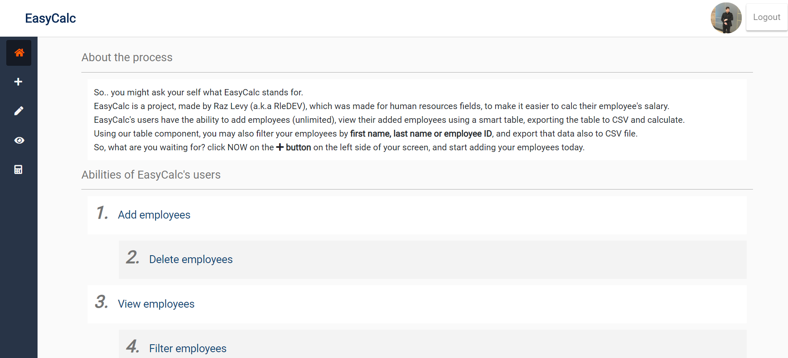

# EasyCalc

An interactive website made with ReactJS (Redux), Express (NodeJS) & MySQL which allows users to login with google oauth, and manage their employees information (Add / Delete / Update), and calculate their employees salary based on that information.

## EasyCalc user abilities

Using EasyCalc, the end user have a few abilities he can use:
1. `Add Employee` - Using 'Add Employee' dashboard, the end user may add new employee after filling the employee's personal information.
2. `Update Sales` - Using 'Update Sales' dashboard, the end user may update his employee's sales using the employee ID and the employee's email as a verification.
3. `View All` - Using 'View All' dashboard, the end user may see all the employees he used to add in the past, and also search for a specific employee by filtering it based on the employee's first name / last name or employee ID, and also export all employees table to CSV.
4. `Calc Salary` - Using 'Calc Salary' dashboard the end user may view all his employees salaries.

## EasyCalc UI Design

I've designed EasyCalc with CSS based on flex box to make it a responsive website, there's a navbar on the top, with a login / logout button on the top right, and next to it on the left, you may see your google's account image.
On the left top, it's EasyCalc banner, which is clickable and will navigate you to the main dashboard.
I've also made a responsive sidebar which will expand when the mouse is hover it, and will get back to normal when the mouse is not on it.

## Backend

Using Express server, I've sent MySQL queries, so the webapp may save the employee's for each user.

## Installation

Please use `npm install` to install all related packages.

## Configuration 

You'll have to make a `config.js` file inside `server` directory with the following variables to make your database work :
`
exports.loginData = {
    cnfHost: "hostURL",
    cnfUser: "DBUser",
    cnfPassword: "DBPassword",
    cnfDatabase: "DBName"
}
`

## How to run 

Please use `npm run dev` to start the webapp using the express server, or `npm start` to run ReactJS project only.

## Images

